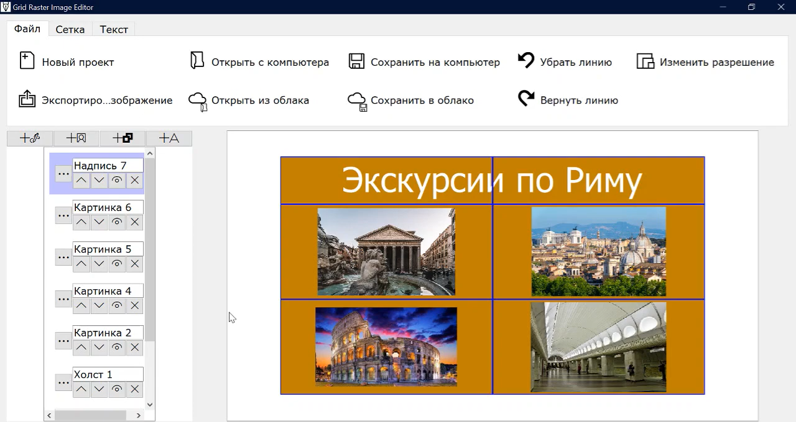

# Grid raster image editor

Grid Raster Image Editor is a graphics editor developed from October 2022 to
November 2023 (with the most active development phase between June 
and November 2023). Its tech stack includes PyQt5, Flask MongoDB and pymongo.
Its most prominent differences from other editors include grid-related
features such as snapping and aligning pictures to a grid, which make it easier
to create professional-looking images quickly. It also has a notably gradual
learning curve in comparison to programs such as Photoshop and GIMP.

The project is divided in two parts: the client side and the server side.
The client side is the editor itself, run as a desktop application,
whereas the server side manages the user accounts and their projects stored
on the server ("in the cloud").



[Feature demo video (in Russian)](https://youtu.be/r7h69QC-WBc?si=uUUCVnRehkUHXb4d)

## Running the project

### Client side

* Clone this GitHub repository
* Install all dependencies as stated in [requirements.txt](requirements.txt)
* Run [client/src/main.py](client/src/main.py)
* Without running the server side, "cloud" features will not work properly

### Server side 

* Clone this GitHub repository
* Install all dependencies as stated in 
[server/requirements.txt](server/requirements.txt)
* Run [server/main.py](server/main.py)
* In case the server is not hosted locally, the constant
````SERVER_ADDRESS```` in [client/src/main.py](client/src/main.py)
needs to be changed to the server address ending with a
forward slash

## Features 

* Creation and removal of layers, changing their Z index, moving them around the surface
* Drawing on a raster layer ("canvas") using brushes, an eraser, a paint bucket and shape tools
* Creation of text layers
* Rich text support
* Creation of picture layers, which one can align to the grid and manipulate more easily when
no control of individual pixels is needed
* Shape layers with a "snap to grid" function
* Image export in PNG, JPG and BMG
* Proprietary JSON-based project format
* User account management
* Storing user projects on the server
